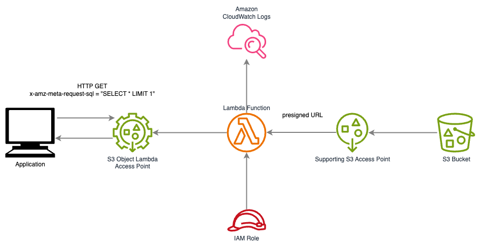

# ObjectLambdaDuckDB

`ObjectLambdaDuckDB` is an example of an architecture and a golang code to deploy
[Amazon S3 Object Lambda](https://aws.amazon.com/s3/features/object-lambda/) for running SQL queries against data
in S3 buckets leveraging [DuckDB](https://duckdb.org/). 

The solution can be used as alternative to deprecated 
[Amazon S3 Select](https://docs.aws.amazon.com/AmazonS3/latest/userguide/selecting-content-from-objects.html).

[The blog post](https://www.linkedin.com/pulse/create-alternative-amazon-s3-select-object-lambda-duckdb-frizner-fnjye) for the solution.

## How to use

You can run SQL queries against data in a S3 bucket sending `GET` request via 
Supporting S3 Access Point (S3 Control Object Lambda Access Point) for the bucket. The S3 Access Point runs
an AWS Object Lambda function to query data and return a result.

As you can see at the code below a SQL query should be defined at `x-amz-meta-request-sql` http header in
format `SELECT ... FROM '%s' ...`.

```python
import boto3
import duckdb

boto3.setup_default_session(profile_name='objectlambda')
s3 = boto3.client('s3')

# SQL query should be define in a http header.
def _add_header(request, **kwargs):
    request.headers.add_header('x-amz-meta-request-sql', "SELECT avg(trip_distance) as avg_distances FROM read_parquet('%s')")

event_system = s3.meta.events
event_system.register_first('before-sign.*.*', _add_header)

# Use your arn for s3control_object_lambda_access_point resource. It is outputted by terraform.
# Change S3 key. 
transformed = s3.get_object(
    Bucket='arn:aws:s3-object-lambda:us-east-1:xxxxxxxxxxxx:accesspoint/objectlambda',
    Key='nyctaxi/yellow/2023/yellow_tripdata_2023-01.parquet'
)
print(transformed['Body'].read().decode('utf-8'))
```

## Architecture


### Components

The solution leverages [S3 Object Lambda](https://aws.amazon.com/s3/features/object-lambda) to process data retrieving 
from S3. The architecture includes the following AWS services:
* S3 Bucket
* IAM Policies and a role to run a Lambda function
* Lambda function
* CloudWatch Log group
* S3 Access point
* Supporting S3 Access Point (S3 Control Object Lambda Access Point)

### How to deploy
To deploy the solution, provide values for variables editing [tf/vars.tf](tf/vars.tf) file or using a command line 
interface; and run [Terraform](https://www.terraform.io/). Since a terraform manifest builds binary of the lambda 
function with `CGO_ENABLED=1` and runs the lambda in `Amazon Linux 2023` runtime on `arm64` architecture; 
recommended environment to run the terraform manifest is Amazon Linux 2023 on `arm64` architecture.
For example, you can use EC2 Graviton instance.

### Object Lambda Function
The lambda function is written in Go and uses DuckDB to run SQL queries therefore It's pretty fast. The lambda uses `Amazon Linux 2023` runtime 
on `arm64` architecture. You may change architecture to `x86_64`.

To provided desired SQL query use http header and set up SQL query in format `SELECT ... FROM '%s' ...`. 
`%s` is used as a placeholder for automatically generated pre-signed URL for a S3 object. 
Examples of queries:
* `SELECT avg(trip_distance) as avg_distances FROM read_parquet('%s')`
* `request.headers.add_header('x-amz-meta-request-sql', "SELECT passenger_count, avg(trip_distance) as avg_distances FROM read_parquet('%s') WHERE passenger_count BETWEEN 1 AND 4 GROUP BY passenger_count")`

## Test results
To run tests I used 
[New York City Taxi and Limousine Commission Trip Record Data](https://www.nyc.gov/site/tlc/about/tlc-trip-record-data.page)
for Yellow Taxi. The duration of a lambda execution is
listed for [the warmed lambda](https://docs.aws.amazon.com/lambda/latest/operatorguide/execution-environments.html). For cold start, add approximately 800-1000ms.
The Lambda is configured with 256 MB of RAM and 512 MB of ephemeral storage.

**Table 1: Results for `SELECT passenger_count, avg(trip_distance) as avg_distances FROM read_parquet('%s') WHERE passenger_count BETWEEN 1 AND 4 GROUP BY passenger_count` query.**

| Object                                | Size     | Rows       | Duration         |
|---------------------------------------|----------|------------|------------------|
| yellow_tripdata_2023-01-small.parquet | 3.2 MB   | 100,000    | 386 ms ± 88.5 ms |
| yellow_tripdata_2023-01.parquet       | 54.6 MB  | 3,066,766  | 2.17 s ± 58.8 ms |
| nyc-yellow-taxi-2023.parquet          | 687.5 MB | 38,310,226 | 24.3 s ± 488 ms  |

To process S3 objects of a big size you can adjust `lambda_ram` variable. Increasing RAM for the lambda increases 
amount of vCPUs provided to the lambda as well. Pay attention that the lambda has to finish in 60 seconds.
For the same query as above deploying lambda with `terraform apply -var="lambda_ram=8192"`
will result:

**Table 1: Processing a big file with increased RAM and ephemeral storage for the lambda**

| Object                        | Size   | Rows        | Duration        |
|-------------------------------|--------|-------------|-----------------|
| nyc-yellow-taxi-202x.parquet  | 2.3 GB | 136,484,348 | 15.2 s ± 495 ms |
 


